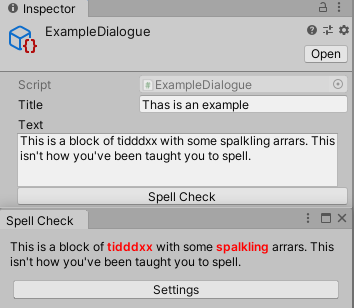
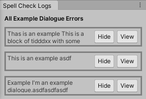

# Unity Simple Spell Check

Unity simple spell check provides a fast and easy way to evaluate text in your game for basic spelling errors. It uses a [local dictionary](https://github.com/dwyl/english-words) and allows for advanced configuration.

## Features

### Usage with text area attributes



This will create a simple spell check button that evaluates a custom text area. If you need some basic spell checking for items or large blocks of text this should help.

```c#
public class ExampleDialogue : ScriptableObject {
    [TextAreaSpellCheck]
    public string text;
}
```

### Usage with advanced project logging



You can log text from anywhere in your game with this pattern. You'll need to do this if you have large amounts of dialogue and you want to evaluate it all at once.

```c#
public class SpellCheckAllDialogue {
    [MenuItem("Spell Check/All Dialogue")]
    public static void CheckAllDialogue () {
        var logList = new List<LogEntry>();

        var guids = AssetDatabase.FindAssets($"t:{typeof(ExampleDialogue).Name}");
        foreach (var guid in guids) {
            var path = AssetDatabase.GUIDToAssetPath(guid);
            var asset = AssetDatabase.LoadAssetAtPath<ExampleDialogue>(path);

            if (!SpellCheck.Instance.IsInvalid(asset.Title) && !SpellCheck.Instance.IsInvalid(asset.Text)) continue;

            var log = new LogEntry($"{asset.Title} {asset.Text}", () => {
                SpellCheck.Instance.ClearValidation();
                SpellCheck.Instance.AddValidation("Title", asset.Title);
                SpellCheck.Instance.AddValidation("Text", asset.Text);
                Selection.activeObject = asset;
            });

            logList.Add(log);
        }

        SpellCheck.Instance.ShowLogs("All Example Dialogue Errors", logList);
    }
}
```

## Installation

Unity Simple Spellcheck is used through [Unity's Package Manager](https://docs.unity3d.com/Manual/CustomPackages.html). In order to use it you'll need to add the following lines to your `Packages/manifest.json` file. After that you'll be able to visually control what specific version of Unity Simple Spellcheck you're using from the package manager window in Unity. This has to be done so your Unity editor can connect to NPM's package registry.

```json
{
  "scopedRegistries": [
    {
      "name": "NPM",
      "url": "https://registry.npmjs.org",
      "scopes": [
        "com.fluid"
      ]
    }
  ],
  "dependencies": {
    "com.fluid.simple-spellcheck": "1.0.0"
  }
}
```

## Releases

Archives of specific versions and release notes are available on the [releases page](https://github.com/ashblue/unity-simple-spellcheck/releases).

## Nightly Builds

To access nightly builds of the `develop` branch that are package manager friendly, you'll need to manually edit your `Packages/manifest.json` as so. 

```json
{
    "dependencies": {
      "com.fluid.simple-spellcheck": "https://github.com/ashblue/unity-simple-spellcheck.git#nightly"
    }
}
```

Note that to get a newer nightly build you must delete this line and any related lock data in the manifest, let Unity rebuild, then add it back. As Unity locks the commit hash for Git urls as packages.

## Development Environment

If you wish to run to run the development environment you'll need to install the latest [node.js](https://nodejs.org/en/). Then run the following from the root once.

`npm install`

If you wish to create a build run `npm run build` from the root and it will populate the `dist` folder.

### Making Commits

All commits should be made using [Commitizen](https://github.com/commitizen/cz-cli) (which is automatically installed when running `npm install`). Commits are automatically compiled to version numbers on release so this is very important. PRs that don't have Commitizen based commits will be rejected.

To make a commit type the following into a terminal from the root

```bash
npm run commit
```

---

This project was generated with [Oyster Package Generator](https://github.com/ashblue/oyster-package-generator).
